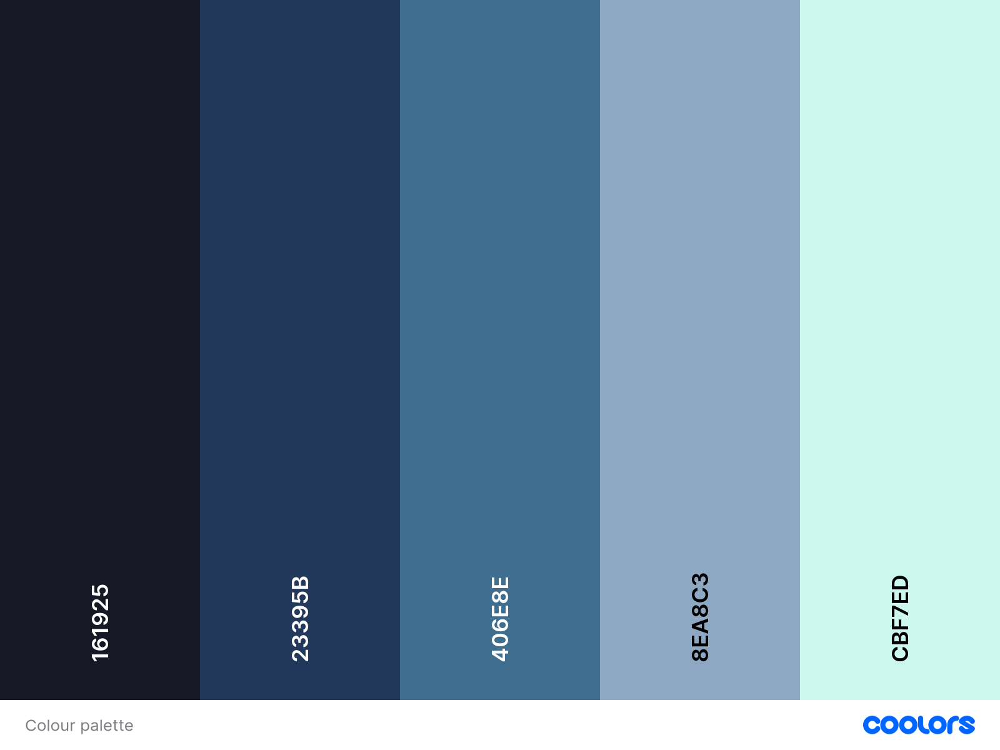
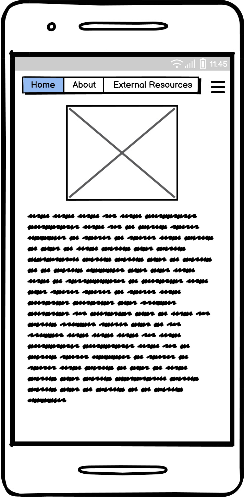
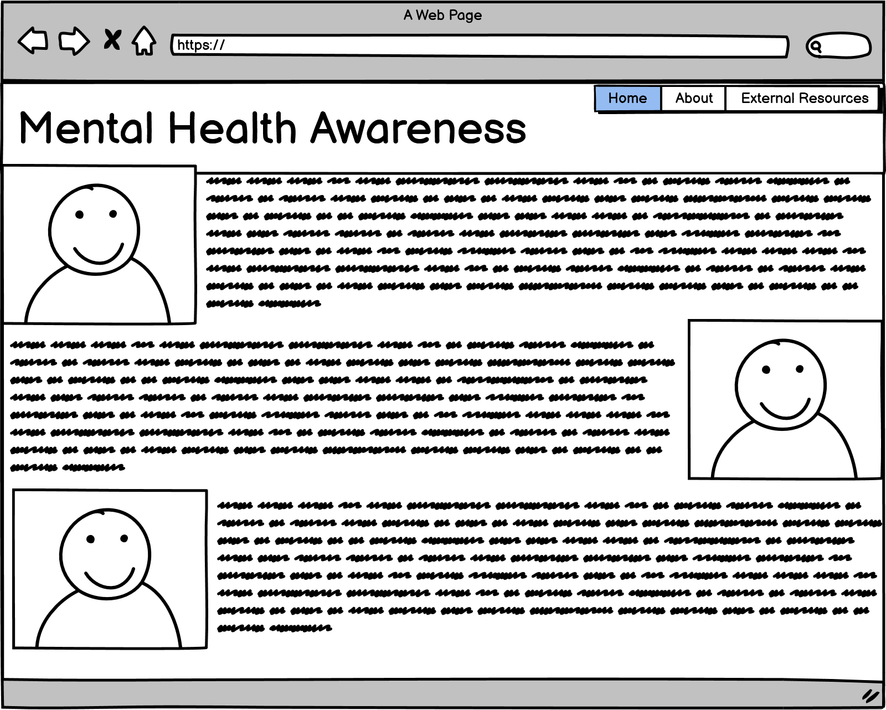

# Formative Assessment - Mental Health Awareness

## Overview

### Purpose
The purpose of this project is to communicate the importance of mental health and raise awareness of it. This will be achieved by clearly displaying information on the subject and by linking to more in depth resources in an easy to use way.

### Target Audience
The target audience is anyone with an interest in learning about mental health.

## User Stories

### Must-Have User Stories
- **As a user I want to be able to navigate the website easily:**   
--  **Acceptance Criteria:** The website has a clear navigation menu allowing all pages to be accessed easily
-  **As a user I want to be able to follow links to other pages**
--  **Acceptance Criteria:** All pages will be linked to each other with links that are clear to the user.
-  **As a user I want to be able to interact with the website without any issues.**
--  **Acceptance Criteria:** There will be no errors, missing content or broken links.
-  **As a visually impaired user I want the website to work well with my screen reader.**
--  **Acceptance Criteria:** The website will contain accessabilty tags throughout enabling screen readers to work well with it.

### Should-Have User Stories
- **As a user I want the site to work on both mobile, desktop and tablet:**  
--  **Acceptance Criteria:** The site will be responsive to changes in screen size and adapt to smaller phones screens as well as larger desktop monitors. All content should still display correctly regardless of device used.
- **As a user I want to have the content in an easy to read format:**   
--  **Acceptance Criteria:** The content will be in an easy to read font and displayed at an apropriate size for the screen it is viewed on. All links and other interactive elements are identified to the screen reader

### Could-Have User Stories
- **As a user when I mouse over an element it reacts to being hovered over.:**   
--  **Acceptance Criteria:** Elements where it is sensible to do so react to being hovered over with the mouse
- **As a site user I can load the page quickly:**   
--  **Acceptance Criteria:** Pictures will be optimised for the web and efforts made to ensure fast loading of the webpage

## Design Decisions

### Colour Palette

These colours were chosen to provide a calming theme for the project while maintaining stylistic consistency.

### Wireframes
Include wireframes for key sections of your website.  
Briefly describe the design choices, including layout, colour schemes, and fonts.  
**Guidance:** Start this section during Phase 1: Ideation & Initial Setup and update it throughout Phase 2 and Phase 3. Include digital wireframes created in Phase 1. Document the reasoning behind your layout choices, colour schemes, and font selections.
**Homepage mobile layout**

This is the layout for mobile. In this version the menu is hidden and makes use of a burger button for a clean look.
**About Desktop layout**

This is the layout for desktop. Making use of the extra space to hide the burger button and instead showing the menu at all times. The menu will always be visible. The content is laid out in containers with the text containers being twice as large as the images and the images with padding taking up a third of the page.

### Typography
**Font**
https://fonts.google.com/share?selection.family=Lexend+Deca:wght@100..900
This font was chosen for both the main body text because it looks neat and is was designed for people with dyslexia and other reading problems in mind. This has the added benefit of increasing accessability. The fallback font is sans-serif. 

### Accessibility Considerations
Discuss how accessibility guidelines were adhered to, including colour contrast and alt text for images.  
**Guidance:** Outline how you've incorporated accessibility into your design, ensuring that your project adheres to guidelines such as WCAG.

## AI Tools Usage

### DALL-E
Describe how DALL-E was used for image generation, including examples of successes and challenges.  
**Guidance:** Specifically mention how you used DALL-E for image generation and the impact this had on your design process.

## Features Implementation

### Core Features (Must-Haves)
- **Feature 1:** Description of the implemented feature.
- **Feature 2:** Description of the implemented feature.

(Include all must-have features)  
**Guidance:** Use this section as you complete Phase 2: Must User Stories Implementation & Testing. Document all the must-have features you implemented, explaining how they align with the user stories and acceptance criteria.

### Advanced Features (Should-Haves)
- **Feature 1:** Description of the implemented feature.
- **Feature 2:** Description of the implemented feature.

(Include all should-have features)  
**Guidance:** Include any advanced features you implemented during Phase 3: Should User Stories Implementation & Any Advanced Features. Explain how these features enhance user experience and their alignment with the acceptance criteria.

### Optional Features (Could-Haves)
- **Feature 1:** Description of the implemented feature (if any).
- **Feature 2:** Description of the implemented feature (if any).

(Include any could-have features that were implemented or considered)  
**Guidance:** If any could-have features were implemented, describe them here. This is an opportunity to showcase extra work done beyond the initial scope. But remember - keep it simple! Focus on the Must stories first. Could user story features are commonly earmarked for future project iterations.

## AI Tools Usage

### GitHub Copilot
Describe how GitHub Copilot assisted in coding, including any challenges or adjustments needed.  
**Guidance:** Reflect on how GitHub Copilot assisted in coding, particularly any challenges or adjustments that were needed to align with project goals.

## Testing and Validation

### Testing Results
Summarize the results of testing across different devices and screen sizes.  
Mention any issues found and how they were resolved.  
**Guidance:** Summarize the results of your testing across various devices using tools like Chrome DevTools, as outlined in Phase 2. Mention any issues found and how they were resolved.

### Validation
Discuss the validation process for HTML and CSS using W3C and Jigsaw validators.  
Include the results of the validation process.  
**Guidance:** Document your use of W3C and Jigsaw validators to ensure your HTML and CSS meet web standards. Include any errors or warnings encountered and how they were resolved.

## AI Tools Usage

### GitHub Copilot
Brief reflection on the effectiveness of using AI tools for debugging and validation.  
**Guidance:** Reflect on how GitHub Copilot assisted with debugging and validation, particularly any issues it helped resolve.

## Deployment

### Deployment Process
This site was deployed using github pages by navigating to settings> pages then choosing to deploy from a branch and setting that branch to be main. 

## AI Tools Usage

### Reflection
Describe the role AI tools played in the deployment process, including any benefits or challenges.  
**Guidance:** Reflect on how AI tools assisted with the deployment process, particularly how they streamlined any tasks or presented challenges.

## Reflection on Development Process

### Successes
Effective use of AI tools, including GitHub Copilot and DALL-E, and how they contributed to the development process.

### Challenges
Describe any challenges faced when integrating AI-generated content and how they were addressed.

### Final Thoughts
Provide any additional insights gained during the project and thoughts on the overall process.  
**Guidance:** Begin drafting reflections during Phase 1 and update throughout the project. Finalize this section after Phase 4. Highlight successes and challenges, particularly regarding the use of AI tools, and provide overall insights into the project.

## Code Attribution
Properly attribute any external code sources used in the project (excluding GitHub Copilot-generated code).  
**Guidance:** Document any external code sources used throughout the entire project, especially during Phase 2 and Phase 3. Exclude GitHub Copilot-generated code from attribution.

## Future Improvements
Briefly discuss potential future improvements or features that could be added to the project.  
**Guidance:** Reflect on potential enhancements that could be made to the project after Phase 4: Final Testing, Debugging & Deployment. These could be Could user story features you didn’t have time to implement or improvements based on testing feedback.